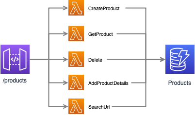

# ewelists.com
This is the central repo and hence starting point of the documentation for this application.  There are a number of repositories that make up the full application.

- [Main](https://github.com/Alex-Burgess/ewelists.com) - Infrastructure templates for deploying the application
- [Web](https://github.com/Alex-Burgess/ewelists.com-web) - The Frontend React Application
- [Services](https://github.com/Alex-Burgess/ewelists.com-services) - The backend APIs for the main application
- [Tools](https://github.com/Alex-Burgess/ewelists.com-tools-backend) - The beginnings of a useful tools web application.


## Contents

- [Overview](#overview)
- [Architecture](#architecture)
- [Implementation details](#implementation-details)
  - [API Services](#api-services)
  - [User Sign up and Authentication](#user-sign-up-and-authentication)
  - [Email](#email)
- [Setup](#setup)
- [Deployments](#deployments)
  - [Test Environment Updates](#test-environment-setup)
  - [Staging and Production Updates](#staging-and-production-setup)
- [Deployment Pipeline](#deployment-pipleine)
- [Testing](#testing)
- [Monitoring](#monitoring)
- [Backup Procedures](#backups)
- [Tools](#tools)
- [Useful Information](#reference)


## Overview
Ewelists is based on a serverless architecture.  The main reasons for this are:
- **Costs:** Hosting/operating costs are in-line with usage of the application
- **Scalability:** AWS resource usage will automatically scale as demand increases over time or for periods of peak or increased demand, e.g. daily/weekly/monthly cycles or advertising campaigns.

**Front end**
- The front end is a React web application, based on [Material Kit PRO React](https://demos.creative-tim.com/material-kit-pro-react/#/), to which custom pages, components, styling, etc has been added.
- The content is deployed to Amazon S3 and Amazon CloudFront provides a globally distributed application.
- AWS Amplify provides the security layer for registration and authentication of users.
- Developed with a Mobile first approach.

**Back end**
- This is a microservice API architecture, using API gateway and Lambda, with functions written in Python.
- AWS SAM provides the framework for project structure, builds, packaging and deployment.

**Database**
- Amazon DynamoDB provides a Serverless database, with "performance at scale"
- An [Adjaceny List Design Pattern](https://docs.aws.amazon.com/amazondynamodb/latest/developerguide/bp-adjacency-graphs.html) is used to model the many-to-many relationships.

**Infrastructure**
- Route53 for DNS and monitoring
- Cognito for user data
- Parameter store for secrets
- SES for sending email
- CloudWatch for logging and alerting
- CodePipeline and CodeBuild for continuous deployments
- AWS WorkMail for email service

## Architecture

**High-level, end-to-end diagram**


**Backend Lists API Services**


**Backend Products API Services**



**Backend NotFound API Services**


**Back Content API Services**


## Implementation Details

### API Services

All services require Authorization, unless specified (+).

**Lists**

GET /lists (ListAll)
POST /lists (CreateList)

DELETE /lists/{:id} (Delete) <br />
GET /lists/{:id} (GetList) <br />
PUT /lists/{:id} (UpdateList)

POST /lists/{:id}/close (Close) <br />
GET /lists/{:id}/shared (GetSharedList) (+)

DELETE /lists/{:id}/product/{:productid} (DeleteProduct) <br />
POST /lists/{:id}/product/{:productid} (AddProduct) <br />
PUT /lists/{:id}/product/{:productid} (UpdateProduct)

POST /lists/{:id}/reserve/{:productid}/email/{email} (ReserveProduct) (+)

PUT /lists/purchase/{:reservationid}/email/{email} (Purchase) (+)

DELETE /lists/reservation/{:id} (DeleteReservation) (+) <br />
GET /lists/reservation/{:id} (Reservation) (+)

DELETE /lists/reserve/{:id}/email/{email} (UnreserveProduct) (+) <br />
PUT /lists/reserve/{:id}/email/{email} (UpdateProductReservation) (+)

**Products**

POST /products (CreateProduct) <br />
DELETE /products/{id} (Delete) <br />
GET /products/{id} (GetProduct) (+)

GET /products/url/{url} (SearchUrl)

**NotFound**

POST /notfound (CreateProduct) <br />
DELETE /notfound/{id} (Delete) <br />
GET /notfound/{id} (GetProduct) (+)

**Contact**

POST /contact (ContactUs) (+)

### User Sign up and Authentication
The following authentication methods are provided:
- Username (Email) and Password
- Google Federation
- Facebook Federation

The username in the Cognito User Pool is random uuid and we store the following user attributes:
- Name
- Email

Users can sign in with multiple methods, i.e. U&P and Google Federation.  If the same email address is used, we want to treat the different authentication methods as the same user, so we link the accounts in the User Pool, so that whatever method they user, we see the same Username id (a.k.a sub).  In order to achieve this we have a Pre sign-up Lambda function (SignUp), that checks if an account exists with the same email, when a user signs up.

If an account exists, the sign up process links the account and throws an exception.  If the sign up process was allowed to complete we would get a duplicate User Pool entry with a different Sub.  This means that the first time a user signs in with a social provider, the linking process needs to complete and effectively fail the sign up process.  The application handles this error and asks the user to sign in again with the same method.

**Handling Google Email Domains**

We have observed users using different google email domains, i.e. @gmail.com and @googlemail.com, both of which are valid for the same user account.  In case of inconsistencies in the way users authenticate with their email address, during the signup process we check for the existence of both if it's a google email.  If the user has previously signed up with a different email address, we inform the user that an account exists.

In the main this works fine, unless the user is trying to sign in with a social provider that has a different email.  e.g. the user has signed up with user@googlemail.com, and they are attempting to sign in with Google Federation which uses user@gmail.com.  If this happens we just ask the user to sign in with their username and password, as we don't want a confusing/difficult experience for the user.

This situation is tricky because it seems that the user will not be able to sign into their Google account with user@googlemail.com, so the only resolution would be for the user to log in with their username and password and update the email address to user@gmail.com.  At the moment we haven't implemented a method for a user to update their email, but doing so in the future would be good if the user wants to make their email usage consistent.

**LoginWithAmazon**

Initially the application made LoginWithAmazon available to users, however for now we have removed button from the log in / sign up forms to reduce the number of scenarios that we have to support and hence the number of possible scenarios for errors/issues.  The configuration is still in place should we wish to re-enable it in the future.

**Cognito Setup Key Components Checklist**
This list was created during the first test configuration of Cognito, so it may be a little outdated.

- Callback Url(s)
- Signout Url(s)
- Allowed OAuth Flows: Authorization code grant
- Allowed OAuth Scopes: email, openid, aws.cognito.signin.user.admin, profile.
- Domain Name
- Social Authentication providers (Facebook, Google, LoginWithAmazon), with attribute mappings.
- React config.js
- Lambda triggers
- Email configuration

### Email
Email is manually configured using AWS Workmail.  Note, when creating a user, ensure that the domain selected is the right one.

To access the Web Email client go to: https://ewelists.awsapps.com/mail

Users are currently sent emails for the following reasons:
- Welcome email on sign up
- A confirmation code on sign up, or password reset, confirming that they own the email address.
- An email confirming they reserved a gift and what steps to take next.
- An email confirming that they marked a reserved gift as purchased.

## Setup

### Pre-Requisites
The API Gateway service must be given permissions to use the CloudWatch service for logging to work.  The creation of this role is a one-time task.

```
aws cloudformation create-stack --stack-name ApiGatewayCloudwatch-Role \
 --template-body file://api-logging.yaml \
 --enable-termination-protection \
 --capabilities CAPABILITY_NAMED_IAM
```

### Manual Procedure (example is Test environment)
The steps below are used to build the test environment of the application.  The procedure is in multiple parts:
- **Auth Infrastructure:** Creates and configures the Cognito resources.
- **Backend Database Infrastructure:** Creates the DynamoDB tables.
- **Backend API services:** Creates the contact, lists, products and notfound services.
- **Web Application:** Creates all the web components.

In the Staging and Production environments, we create the Auth and Database Infrastructure manually.  This is because these are infrequently updated so are of little value adding to the pipeline.  It is also reasonable to be a little more categoric with updates to these resources, for example, so we can take backups when updating them.

Creation of the API services can be left to the [Deployment Pipeline](#deployment-pipeline).

The Web stack creates all the web components, except for the SSL certificate. This is because the SSL certificate needs to be created in the us-east-1 region and it also requires the hosted zone for the environment to be created (which is created by the stack), so that it can be validated.  The certificate ID is stored in a parameter store variable so that it can be programmatically referenced.  In Production, the SSL certificate and the Web stack can be created in just two steps as the hosted zone exists.

**Auth Infrastructure and Configuration**

1. Register with social IdPs: [Procedures](https://docs.aws.amazon.com/cognito/latest/developerguide/cognito-user-pools-social-idp.html#cognito-user-pools-social-idp-step-1)
1. Add social identity providers to parameter store:
    ```
    aws ssm put-parameter --name /ewelists.com/test/Facebook/ClientId --type String --value "123456..."
    aws ssm put-parameter --name /ewelists.com/test/Facebook/ClientSecret --type String --value "123456..."

    aws ssm put-parameter --name /ewelists.com/test/Google/ClientId --type String --value "123456..."
    aws ssm put-parameter --name /ewelists.com/test/Google/ClientSecret --type String --value "123456..."

    aws ssm put-parameter --name /ewelists.com/test/Amazon/ClientId --type String --value "123456..."
    aws ssm put-parameter --name /ewelists.com/test/Amazon/ClientSecret --type String --value "123456..."
    ```
1. Create Auth stack (with termination protection):
    ```
    aws cloudformation create-stack --stack-name Auth-Test \
     --template-body file://auth.yaml \
     --capabilities CAPABILITY_NAMED_IAM \
     --enable-termination-protection \
     --parameters ParameterKey=Environment,ParameterValue=test \
        ParameterKey=SignUpFunction,ParameterValue=
    ```

1. Create SSM parameter with user pool ID, which is specified as an environment variable in the cf template for the signup lambda function.
    ```
    aws cloudformation describe-stacks --stack-name Auth-Test \
     --query "Stacks[0].Outputs[?OutputKey=='userPoolId'].OutputValue" \
     --output text

    aws ssm put-parameter --name /CognitoUserPoolId/test --type String --value "eu-west-1_abcd123e4"
    ```

**Backend Database Infrastructure**

Deploy stack with dynamodb tables.
```
aws cloudformation create-stack --stack-name Database-Test \
 --template-body file://database.yaml \
 --parameters ParameterKey=Environment,ParameterValue=test
```

**Backed API Services**

1. Create an S3 Bucket for each services SAM builds
    ```
    aws s3 mb s3://sam-builds-contact-test
    aws s3 mb s3://sam-builds-lists-test
    aws s3 mb s3://sam-builds-notfound-test
    aws s3 mb s3://sam-builds-products-test
    ```
1. Create Email Templates used by Services (this is a master stack which creates nested stacks)
    ```
    cd ewelists.com-services/cloudformation

    aws s3 mb s3://email-templates-ewelists-test

    aws s3 cp . s3://email-templates-ewelists-test/ --recursive --exclude "*" --include "email-template-*"

    aws cloudformation create-stack --stack-name Email-Templates-Test \
     --template-body file://email-templates-master-stack.yaml
    ```
1. Deploy Contact Service
    ```
    cd ewelists.com-services/Contact

    sam build

    sam package \
     --output-template-file packaged.yaml \
     --s3-bucket sam-builds-contact-test

    sam deploy \
     --stack-name Service-contact-test \
     --template-file packaged.yaml \
     --capabilities CAPABILITY_NAMED_IAM
    ```
1. Deploy Lists Service
    ```
    cd ewelists.com-services/Lists

    sam build

    sam package \
        --output-template-file packaged.yaml \
        --s3-bucket sam-builds-lists-test

    sam deploy \
        --template-file packaged.yaml \
        --stack-name Service-lists-test \
        --capabilities CAPABILITY_NAMED_IAM
    ```
1. Deploy NotFound Service
    ```
    cd ewelists.com-services/NotFound

    sam build

    sam package \
        --output-template-file packaged.yaml \
        --s3-bucket sam-builds-notfound-test

    sam deploy \
        --template-file packaged.yaml \
        --stack-name Service-notfound-test \
        --capabilities CAPABILITY_NAMED_IAM
    ```
1. Deploy Products Service
    ```
    cd ewelists.com-services/Products

    sam build

    sam package \
        --output-template-file packaged.yaml \
        --s3-bucket sam-builds-products-test

    sam deploy \
        --template-file packaged.yaml \
        --stack-name Service-products-test \
        --capabilities CAPABILITY_NAMED_IAM
    ```
1. Update auth stack with Pre sign-up trigger Lambda function:
    ```
    aws cloudformation update-stack --stack-name Auth-Test \
     --template-body file://auth.yaml \
     --capabilities CAPABILITY_NAMED_IAM \
     --parameters ParameterKey=Environment,ParameterValue=test \
      ParameterKey=SignUpFunction,ParameterValue=lists-signup
    ```
1. **Test:** Import postman collection json files and update environment variables storing api url IDs.

**Web Application**

1. **Web Stack:** Create Web stack with default SSL certificate.
    ```
    aws cloudformation create-stack --stack-name Web-Test --template-body file://web.yaml \
      --parameters ParameterKey=Environment,ParameterValue=test \
      ParameterKey=DefaultSSLCertificate,ParameterValue=true
    ```
1. **Content:** Create a build of the content and copy to S3.
    ```
    npm run build
    mv build/staging.robots.txt build/robots.txt
    aws s3 sync build/ s3://test.ewelists.com --delete
    ```
1. **SSL Certificate:** Create SSL certificate. Stack will remain in CREATE_IN_PROGRESS state until the certificate is validated, so proceed to next step - see [acm docs](https://docs.aws.amazon.com/AWSCloudFormation/latest/UserGuide/aws-resource-certificatemanager-certificate.html) for more details.
    ```
    aws cloudformation create-stack --region us-east-1 --stack-name Web-SSL-Test \
    --template-body file://web-sslcert.yaml \
    --parameters ParameterKey=Environment,ParameterValue=test
    ```
1. **Validate SSL Certificate:** Validate certificate request using console (See [blog](https://aws.amazon.com/blogs/security/easier-certificate-validation-using-dns-with-aws-certificate-manager/) for steps).
1. **Parameter Store:** Create a parameter to store the SSL certificate ID.
    ```
    aws cloudformation describe-stacks --stack-name Web-SSL-Test --region us-east-1 \
     --query 'Stacks[].Outputs[?OutputKey==`CertificateArn`].OutputValue' --output text | awk -F\/ '{print $2}'

    aws ssm put-parameter --name /ewelists.com/test/SSLCertificateId --type String \
     --value "f38ecd9a-...."
    ```
1. **Update Web Stack:** Update the main stack to use the SSL certificate.
    ```
    aws cloudformation update-stack --stack-name Web-Test --template-body file://web.yaml \
      --parameters ParameterKey=Environment,ParameterValue=test
    ```
1. **Test:** Browse to https://test.ewelists.com (**Note:** Sign up and log in does not work unless User Pool Callback URLs are updated.)

## Deployments

**Auth Stack Updates**

1. Backup the Cognito UserPool: See [Cognito UserPool Backup](#cognito-userpool-backup)
1. Update stack:
    ```
    aws cloudformation update-stack --stack-name Auth-Test \
     --template-body file://auth.yaml \
     --capabilities CAPABILITY_NAMED_IAM \
     --parameters ParameterKey=Environment,ParameterValue=test \
      ParameterKey=SignUpFunction,ParameterValue=lists-signup
    ```

**Database Stack Updates**

```
aws cloudformation update-stack --stack-name Database-Test \
 --template-body file://database.yaml \
 --parameters ParameterKey=Environment,ParameterValue=test
```

**Update email templates used by API Services**

```
cd ewelists.com-services/cloudformation

aws s3 mb s3://email-templates-ewelists-test

aws s3 cp . s3://email-templates-ewelists-test/ --recursive --exclude "*" --include "email-template-*"

aws cloudformation create-stack --stack-name Email-Templates-Test \
 --template-body file://email-templates-master-stack.yaml
```

**Update API Service (e.g. Lists)**

```
cd ewelists.com-services/Lists

sam build

sam package \
    --output-template-file packaged.yaml \
    --s3-bucket sam-builds-lists-test

sam deploy \
    --template-file packaged.yaml \
    --stack-name Service-lists-test \
    --capabilities CAPABILITY_NAMED_IAM
```

**Update Web Application Infrastructure**

1. **Update Web Stack:** Update the main stack to use the SSL certificate.
    ```
    aws cloudformation update-stack --stack-name Web-Test --template-body file://web.yaml \
      --parameters ParameterKey=Environment,ParameterValue=test
    ```
1. **Invalidate Cache:**
    ```
    aws cloudfront list-distributions --query "DistributionList.Items[?AliasICPRecordals[?CNAME=='test.ewelists.com']].{ID:Id}" --output text
    aws cloudfront create-invalidation --paths '/*' --distribution-id ABCDEFGHIJK12
    aws cloudfront wait invalidation-completed --distribution-id ABCDEFGHIJK12 --id IJKLMNOPQRSTUV
    ```

**Update Web Application Content**

1. **Content:** Create a build of the content and copy to S3.
    ```
    npm run build
    mv build/staging.robots.txt build/robots.txt
    aws s3 sync build/ s3://test.ewelists.com --delete
    ```
1. **Invalidate Cache:**
    ```
    aws cloudfront list-distributions --query "DistributionList.Items[?AliasICPRecordals[?CNAME=='test.ewelists.com']].{ID:Id}" --output text
    aws cloudfront create-invalidation --paths '/*' --distribution-id ABCDEFGHIJK12
    aws cloudfront wait invalidation-completed --distribution-id ABCDEFGHIJK12 --id IJKLMNOPQRSTUV
    ```

## Deployment Pipeline

**Pipeline Execution**

Github is the Single source of truth for our web stack and content deployments.  Whenever there is a commit/pull request to the Master branch of either the main or web github projects, this will trigger the pipeline.

Updating the Web content, means that the CloudFront cache needs to be invalidated.  This can be an expensive operation, and also can impact user performance when using the site, i.e. it will be slower if not cached. So, we want to try to avoid updating the web content unless necessary.

The buildspec for the React deployment has a piece of logic to prevent web content from being updated unless necessary.  The rules are:
- **Manual Execution:** This is determined if the pipeline execution trigger was "StartPipelineExecution" (and not "Webhook").  A manual execution of the pipeline will be the fall back to ensure that everything is deployed correctly if there is an issue.
- **OR Web repo commit sha's different:** If the Web repo commit sha's are different between the current pipeline execution and previous pipeline execution, then there was definitely a web content update.
- **OR Previous Pipeline State == Succeeded:** There are a number of [pipeline states](https://docs.aws.amazon.com/cli/latest/reference/codepipeline/list-pipeline-executions.html) that we may encounter. In normal operation, we may particularly see "Superseded" whilst we suspend updates to the Prod stage, which mean that we may push 4 or 5 changes across all the repo's to production at once.  So, unless the state of the previous execution was "Succeeded" we can't be sure that we haven't missed a web content update.

**Future Improvements**
The main repo is triggered whenever there is a commit to the main branch, which could be docs updates, stack updates, or script updates. Only the `web.yaml` stack is actually deployed by the pipeline, so a lot of updates are triggering the pipeline unnecessarily. The pipeline webhook does allow filters, which can be used to return the tags, like so:

```
-
  JsonPath: "$.ref"
  MatchEquals: refs/tags/web*
```

However, at the moment they do not accept wildcard tags, so tagging with 'web-1.0.0' doesn't trigger the pipeline. If wildcards do become available this could be a useful addition.


**Pipeline Exclusions**

The web pipeline doesn't include SSL certificate creation, although this could be automated in the future.  Therefore there is some setup required when creating the environments for the first time.  After this the pipeline is used for all changes.  

The auth and database stacks are not handled by the pipeline.

### Create Web CI/CD Pipeline
1. **Personal Access Token:** In github developer settings, create a Personal access token, with repo and admin:repo_hook scopes.  Add the token to the parameter store.
    ```
    aws ssm put-parameter --name "/ewelists.com/github" --value "123456abcde...." --type SecureString
    ```
1. **Create a github secret for the webhooks:**  When the stack is created in the step below, you should see a Webhook created in each of the repo's settings.
    ```
    ruby -rsecurerandom -e 'puts SecureRandom.hex(20)'
    aws ssm put-parameter --name "/ewelists.com/github_secret" --value "123456abcde...." --type SecureString
    ```
1. Add Postman API Key to Parameter store:
    ```
    aws ssm put-parameter --name /Postman/Key --type SecureString --value "PMAK-5da0....???"
    ```
1. Add Postman Collection and Environment IDs to parameter store (See [Postman](#Postman) reference commands for retrieving IDs.):
    ```
    aws ssm put-parameter --name /Postman/Collection/Lists --type String --value "6596444-38afc6ee-????"
    aws ssm put-parameter --name /Postman/Collection/NotFound --type String --value "6596444-38afc6ee-????"
    aws ssm put-parameter --name /Postman/Collection/Products --type String --value "6596444-38afc6ee-????"
    aws ssm put-parameter --name /Postman/Collection/Contact --type String --value "6596444-38afc6ee-????"
    aws ssm put-parameter --name /Postman/Environment/Staging --type String --value "6596444-ea7ff6c9-??????"
    aws ssm put-parameter --name /Postman/Environment/Prod --type String --value "6596444-ea7ff6c9-??????"
    ```
1. Add the cognito userpool ID to parameter store:
    ```
    aws ssm put-parameter --name /CognitoUserPoolId/prod --type String --value "eu-west-1_12345678"
    ```
1. Create pipeline artifact buckets:
    ```
    aws cloudformation create-stack --stack-name Pipeline-Artifacts-Main-EU \
     --template-body file://pipeline-artifact-bucket.yaml \
     --parameters ParameterKey=PipelineName,ParameterValue=main

    aws cloudformation create-stack --stack-name Pipeline-Artifacts-Main-US \
      --region us-east-1 \
      --template-body file://pipeline-artifact-bucket.yaml \
      --parameters ParameterKey=PipelineName,ParameterValue=main
    ```
1. **Pipeline Stack:** Create the stack, using the cli to import the oauth token from the parameter store.
    ```
    aws cloudformation create-stack --stack-name Pipeline-Web \
     --template-body file://pipeline-web.yaml \
     --capabilities CAPABILITY_NAMED_IAM \
     --parameters ParameterKey=GitHubToken,ParameterValue=`aws ssm get-parameter --name "/ewelists.com/github" --with-decryption --query 'Parameter.Value' --output text` \
       ParameterKey=GitHubSecret,ParameterValue=`aws ssm get-parameter --name "/ewelists.com/github_secret" --with-decryption --query 'Parameter.Value' --output text`
    ```

### Update Web Pipeline
```
aws cloudformation update-stack --stack-name Pipeline-Web \
 --template-body file://pipeline-web.yaml \
 --capabilities CAPABILITY_NAMED_IAM \
 --parameters ParameterKey=GitHubToken,ParameterValue=`aws ssm get-parameter --name "/ewelists.com/github" --with-decryption --query 'Parameter.Value' --output text` \
   ParameterKey=GitHubSecret,ParameterValue=`aws ssm get-parameter --name "/ewelists.com/github_secret" --with-decryption --query 'Parameter.Value' --output text`
```

## Testing
### Unit and Integration Testing
See the [Services](https://github.com/Alex-Burgess/ewelists.com-services) documentation for details on unit and integration testing.


### UI / Functional Testing
1. [Cross Platform](./devices.md)
1. [Web General](./webGeneral.md)
1. [Authentication](./authentication.md)

## Monitoring
### Availability Monitoring
Route53 Health Checks can be used to monitoring the availability of the website.  Combining this with CloudWatch Alarms and SNS, it is then possible to send emails when issues occur.  In addition to basic availability monitoring, we also monitor requests received by the CloudFront distribution.

We want to monitor a page that has no cache, so that we are alerted if there is an issue with underlying static website (i.e. on s3) a.s.a.p.  As files can be cached for days, there could be an issue and we wouldn't find out for hours, which would also be at the same time that users find out about the issue.  To facilitate this, we use a static html page with no cache.  For staging and production the buildspec file takes cache of copying this file with the correct no-cache metadata.

The pipeline creates the monitoring resources for Staging and Production.  To create the resources for testing:

1. **CloudFront ID:** Get the Primary CloudFront Distribution ID
    ```
    aws cloudformation describe-stacks --stack-name Web-Test \
     --query 'Stacks[].Outputs[?OutputKey==`WebCloudFrontID`].OutputValue' --output text
    ```
1. **Health Checks:** Create the health checks stack (us-east-1)
    ```
    aws cloudformation create-stack --region us-east-1 \
     --stack-name Monitoring-Health-Test \
     --template-body file://monitoring-health.yaml \
     --parameters ParameterKey=Environment,ParameterValue=test \
      ParameterKey=CloudFrontId,ParameterValue=ERMURB624JFBW
    ```
1. **Confirm Subscription:** An email requesting confirmation of the subscription for the email address will be sent.  Click on the link to confirm the subscription.

### Performance Monitoring
Work in progress.

## Backup Procedures

We backup dynamodb data and cognito user pool, so that in the event of a complete disaster we would have everything we would need to rebuild from scratch.

*Note:* Could think about storing backups in another region for more options.

### DynamoDB Backup

Point-in-time-recovery provides continuous backups of the table data, for the last 35 days.  See [Documentation](https://aws.amazon.com/dynamodb/backup-restore/) for more detail.

### Cognito UserPool Backup
Cognito does not have a backup option.

There are two independent tools:
- https://www.npmjs.com/package/cognito-backup
- https://www.npmjs.com/package/cognito-backup-restore

Both seem to perform backup and restore.  Using cognito-backup for now.

1. Install:
    ```
    npm install -g cognito-backup
    ```
1. Get user pool ids:
    ```
    aws cognito-idp list-user-pools --max-results 10
    ```
1. Backup:
    ```
    cognito-backup backup-users <USERPOOL_ID> --region eu-west-1 --file userpool-<ENV>-`date +"%Y-%m-%d"`.json
    ```
1. Copy backup to s3 bucket:
    ```
    aws s3s cp userpool-<ENV>-2019-11-29.json s3://cognito-ewelists-backups-<ENV>
    ```


## Tools

**Testing Data**

Information on how to export data from a table for testing purposes is available [here](documentation/reference.md#export-prod-data-for-testing-in-test-or-staging).

**Tools API**

There is a tools API, which currently just provides a mechanism to update the details of products not found.

The code for this API is available at the [ewelists.com-tools-backend](https://github.com/Alex-Burgess/ewelists.com-tools-backend) repository.

The procedure for updating product info is available at [How to Handle Not Found Product](documentation/reference.md#how-to-handle-not-found-product)

## Useful Information
See [here](documentation/reference.md) for useful commands and procedures.
